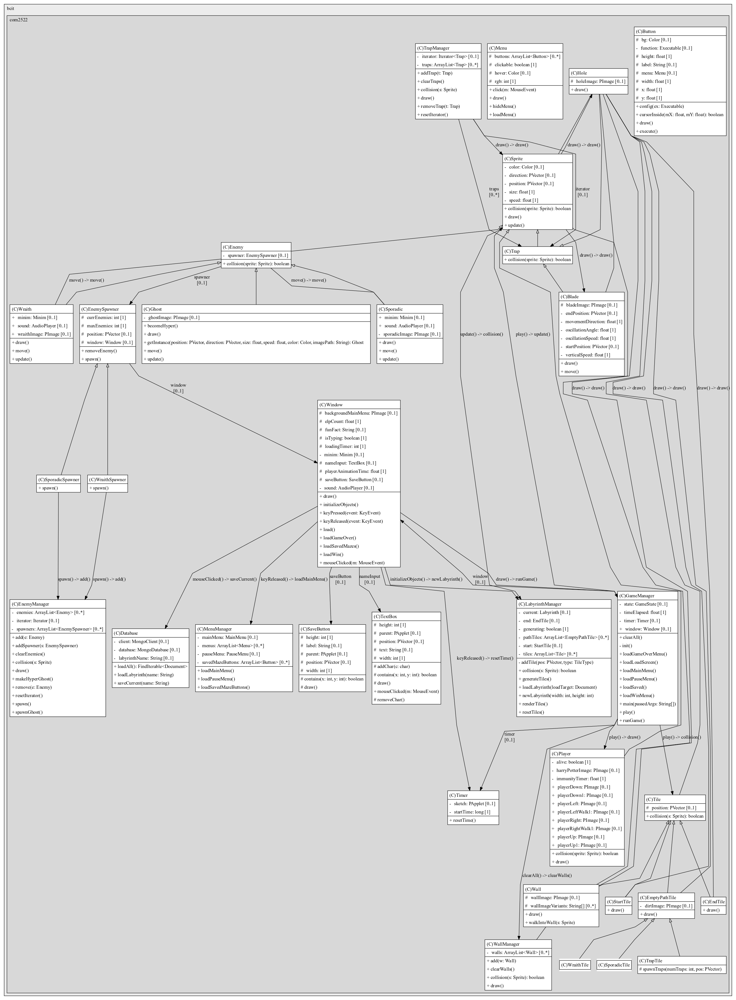

# project-a-maze-ing
Dodge ghouls, spiders and blades as you maneuver our randomly generated maze! Created by Nelson Peterson-Hui, Matthew Siggs, Alex Sichitiu, Laurie Solkoski, and Yegor Assanovich

# Instructions
1. Run GameManager.java
2. Select "Play"
3. Your starting point is the blue square. Move your player around using the 
arrow keys on your keyboard and dodge all the obstacles (Wraiths, Blades, Holes, Spiders, and the Ghost).
4. Navigate the maze until you find the end which is a green square.
5. If you complete the maze and like it, give the maze a name and save it to our database
6. Select "Load All Saved Mazes" if you would like to load a specific maze that you or someone else have won in the past.

# Code Contributions

**Nelson Peterson-Hui**
* Sprite Mechanics Architect
* Animations artist
* Sound designer
* Debugger 

**Alex Sichitiu**
* Implemented menus and buttons
* Developed initial game state management in Window
* Implemented Wall
* Generally helped wherever needed by adding features, debugging, rafactoring etc.

**Laurie Solkoski**
* Helped with returning documents in the "labyrinths" collection of the MongoDB database.
* Created the traps (with Nelson), Trap and Trap Manager
* Helped with Menu, Menu Manager and Button implementation
* Developed initial Loading menu
* Refractored

**Yegor Assanovich**
*Made test classes for all possible classes*
*Added additional methods to all tested classes*

**Matthew Siggs**
* Created Labyrinth generation and randomization algorithm
* Created Tile Class super and subclass structure
* Implemented Game, Labyrinth and Enemy Managers
* Implemented Labyrinth, Maze Generation Queue and Queue Node
* Implemented Start, End, Empty Path, Wraith Tile types
* Implemented Spawners
* Implemented Database reading and writing
* Heavily modified Window class
* Created Game State, Directions and Tile type enumerations and implementation
* Refactored 
* Debugged

# Overall UML

